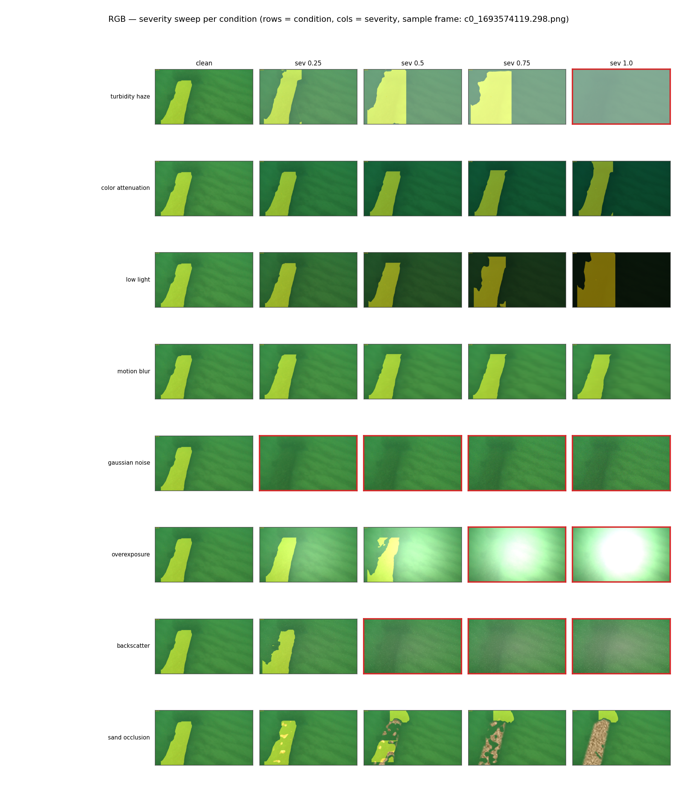
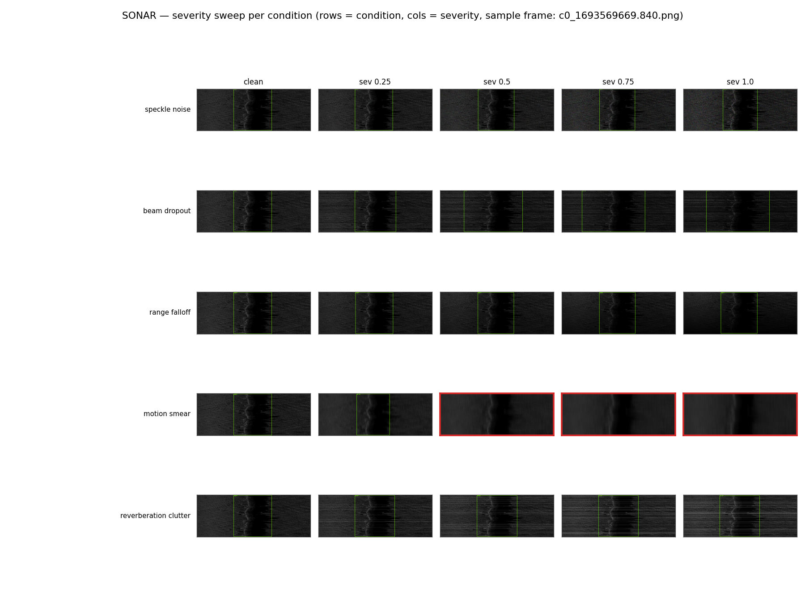
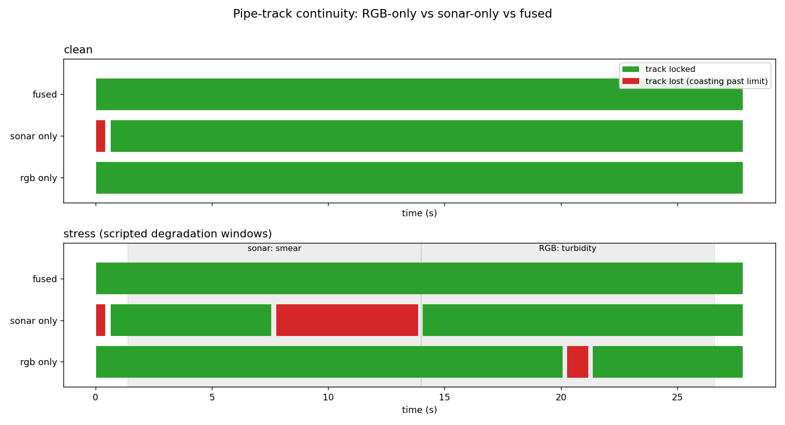
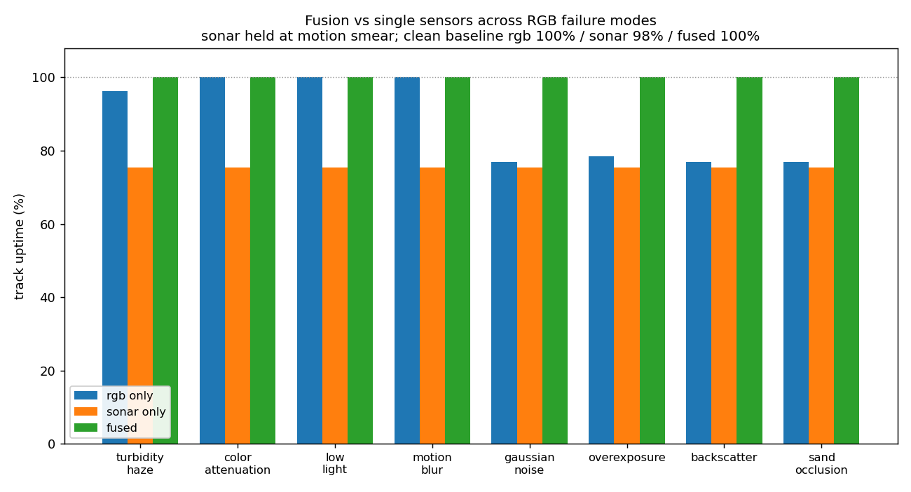

# Multimodal Underwater Pipeline Inspection on the Edge


A multimodal pipeline-inspection system on real autonomous-underwater-vehicle data
(**SubPipe**): an **RGB segmentation** model and a **side-scan sonar detection**
model, **fused at the track level** along the vehicle's INS trajectory and
accelerated for the **NVIDIA Jetson AGX Orin** with **ONNX and TensorRT FP16**.
Clean accuracy is **mask mAP50 0.80** (camera) and **box mAP50 0.995** (sonar),
TensorRT FP16 delivers a **1.7x edge speedup**, and under degradation the **fused
track holds 100% continuity** on a window where a single sensor drops to 75%.

## Demo

Per-sensor pipelines on continuous SubPipe footage: the pipe mask for the camera,
detection boxes for the sonar, with a HUD showing detection score and live
inference time.

<table>
  <tr>
    <th align="center">RGB segmentation</th>
    <th align="center">Side-scan sonar detection</th>
  </tr>
  <tr>
    <td><video src="results/inference/rgb_demo.mp4" controls width="100%"></video></td>
    <td><video src="results/inference/sonar_demo.mp4" controls width="100%"></video></td>
  </tr>
</table>

<sub>To embed: drag <code>results/inference/rgb_demo.mp4</code> and
<code>sonar_demo.mp4</code> into any GitHub comment to generate asset URLs, then
paste them into the two <code>src</code> fields above. The fused RGB+sonar demo is
in progress.</sub>

## Edge performance (Jetson AGX Orin, TensorRT FP16)

> **Device**: NVIDIA Jetson AGX Orin · **Precision**: FP16 · exported via ONNX,
> engine built on-device with `trtexec`. Results in `results/benchmark/`.

| Model | Backend | Latency (ms) | Throughput (FPS) | Speedup |
|---|---|---|---|---|
| RGB segmentation | PyTorch | 23.0 | 43.5 | 1.00x |
| **RGB segmentation** | **TensorRT FP16** | **13.2** | **75.3** | **1.74x** |
| Sonar detection | PyTorch | 18.5 | 54.0 | 1.00x |
| **Sonar detection** | **TensorRT FP16** | **10.9** | **91.3** | **1.70x** |

**Key finding**: FP16 on the Orin's Tensor Cores gives a **1.7x** speedup on both
models, putting each stream above **75 FPS**, comfortably real-time for a vehicle
that surveys at a few frames per second.

## Architecture

The camera and sonar do not share a viewpoint, so fusion is **track-level** along
the AUV's INS trajectory, not pixel-to-pixel. Each modality contributes a position
measurement when confident; a Kalman filter coasts the track through dropouts.

```
RGB camera  -> [ YOLO11-seg ]  -> pipe mask  --\
                                                 >-- [ Late fusion + Kalman ] -> fused pipe track
Side-scan   -> [ YOLO11 detect ] -> boxes  -----/        (along the AUV trajectory)
INS / nav   ------------------------------------- vehicle pose / along-track position
```

| Stage | Model | Input | Clean accuracy |
|---|---|---|---|
| RGB segmentation | YOLO11n-seg | 1024 px | mask mAP50 **0.801** |
| Sonar detection | YOLO11n | 1024 px | box mAP50 **0.995** |
| Fusion | Kalman track over [pos, vel, heading] | per-frame measurements | see below |

Stack: PyTorch, Ultralytics YOLO11, ONNX Runtime, NVIDIA TensorRT, OpenCV,
filterpy. Plain venv + pip + git, no Docker.

## Robustness: complementary failure modes

Each model is scored on its clean validation set, then re-scored after a bank of
physically motivated underwater degradations at four severities (0.25 to 1.0), via
`scripts/evaluate_robustness.py`. The point is that the two sensors fail under
different conditions.

### RGB (optical), mask mAP50, clean = 0.801

| condition | 0.25 | 0.50 | 0.75 | 1.00 |
|---|---|---|---|---|
| color_attenuation | 0.798 | 0.808 | 0.796 | 0.774 |
| motion_blur | 0.781 | 0.772 | 0.784 | 0.823 |
| low_light | 0.790 | 0.829 | 0.585 | 0.137 |
| turbidity_haze | 0.742 | 0.459 | 0.173 | 0.039 |
| overexposure | 0.745 | 0.436 | 0.000 | 0.000 |
| backscatter | 0.607 | 0.162 | 0.002 | 0.000 |
| sand_occlusion | 0.557 | 0.144 | 0.010 | 0.001 |
| gaussian_noise | 0.151 | 0.000 | 0.001 | 0.000 |

### Sonar (acoustic), box mAP50, clean = 0.995

| condition | 0.25 | 0.50 | 0.75 | 1.00 |
|---|---|---|---|---|
| range_falloff | 0.995 | 0.995 | 0.995 | 0.985 |
| speckle_noise | 0.995 | 0.994 | 0.974 | 0.985 |
| reverberation_clutter | 0.970 | 0.938 | 0.887 | 0.822 |
| beam_dropout | 0.946 | 0.863 | 0.732 | 0.673 |
| motion_smear | 0.964 | 0.653 | 0.181 | 0.080 |

**Key finding**: the failure profiles are nearly disjoint. Optical conditions
(turbidity, darkness, noise, backscatter) collapse the camera but leave the
acoustic sonar essentially untouched, while the one thing that destroys the sonar,
along-track motion smear, is exactly what the camera shrugs off (motion blur, flat
near 0.78). Each sensor's worst case is the other's comfortable regime.

<table>
  <tr>
    <th align="center">RGB degradations (clean to severity 1.0)</th>
  </tr>
  <tr>
    <td></td>
  </tr>
  <tr>
    <th align="center">Sonar degradations (clean to severity 1.0)</th>
  </tr>
  <tr>
    <td></td>
  </tr>
</table>

<sub>Small RGB validation set (21 frames), so high-severity cells of robust
conditions carry sampling noise. Degradations are synthetic approximations tuned
for plausibility.</sub>

## Fusion: holding the track through sensor failures

`scripts/find_coobservation.py` searches the full SubPipe survey for a window where
both sensors see the pipe at once. This is rare by geometry: the camera looks down,
the side-scan sonar looks sideways with a blind nadir gap, so the vehicle is flown
in legs that favor one sensor or the other.

| chunk | sonar pipe-visible | camera masks | both models fire |
|---|---|---|---|
| Chunk0 | 62.7% | 0 | no (sonar leg) |
| Chunk1 | 45.7% | 0 | no |
| Chunk2 | 80.7% | 107 | no (pipe in both per ground truth, sonar model misses near-nadir) |
| Chunk3 | 15.3% | 0 | yes (~12 s) |
| Chunk4 | 64.9% | 0 | no (sonar leg) |

**Finding**: genuine co-observation in real inspection data is sparse and
geometry-driven, itself an argument for sensor redundancy. Chunk2 is co-observed in
ground truth but the sonar model (trained on a different leg) misses its near-nadir
returns; retraining on all chunks is a tracked enhancement.

On the co-observed window (Chunk3) with two staggered, physically motivated
degradations (sonar motion smear early, camera turbidity late), the fused track
stays locked while each single sensor drops during its own failure
(`scripts/run_fusion_ablation.py`):

| mode | clean | stress (staggered failures) |
|---|---|---|
| rgb_only | 100.0% | 96.3% |
| sonar_only | 97.8% | 75.4% |
| **fused** | **100.0%** | **100.0%** |

Sweeping all eight RGB failures (sonar held at motion smear) with
`scripts/sweep_fusion_conditions.py`, the fused track holds 100% throughout while
the camera-only track drops by an amount set by how badly each condition hurts the
camera:

| RGB condition under stress | rgb_only | sonar_only | fused |
|---|---|---|---|
| color_attenuation / low_light / motion_blur | 100.0% | 75.4% | **100.0%** |
| turbidity_haze | 96.3% | 75.4% | **100.0%** |
| overexposure | 78.4% | 75.4% | **100.0%** |
| gaussian_noise / backscatter / sand_occlusion | 76.9% | 75.4% | **100.0%** |

<table>
  <tr>
    <th align="center">Track continuity (clean vs stress)</th>
    <th align="center">Fusion vs single sensors across RGB failures</th>
  </tr>
  <tr>
    <td></td>
    <td></td>
  </tr>
</table>

**Key finding**: the fused estimate matches whichever sensor is healthy at each
moment, so it beats both single-sensor modes whenever one fails. `sonar_only` is
flat because its failure is the same in every run, which is the point: fusion is
not just "trust the sonar," since the sonar fails too.

<sub>The co-observed window is short (28 s, about 12 s of true overlap), so
single-sensor failures here are real but brief; the sustained version waits on the
sonar retrain.</sub>

## Setup

```bash
# Thunder VM (training / dev)
python -m venv .venv && source .venv/bin/activate
pip install --upgrade pip && pip install -r requirements.txt
python scripts/verify_setup.py            # confirms CUDA + imports
```

```bash
# Jetson AGX Orin (edge inference)
python3 -m venv --system-site-packages .venv   # keep system tensorrt importable
source .venv/bin/activate
pip install --upgrade pip && pip install -r requirements-jetson.txt
python scripts/verify_setup.py
```

ONNX carries each model from the VM to the Jetson; the TensorRT engine is built
on-device (engines are GPU and version specific). Code travels via GitHub.

## Reproduce the results

```bash
# Per-sensor demo videos
python scripts/make_demo_video.py --modality rgb   --max-frames 600
python scripts/make_demo_video.py --modality sonar --max-frames 400

# Robustness sweep (tables + severity overviews)
python scripts/evaluate_robustness.py

# Find a co-observed chunk, then the fusion ablation on it
python scripts/find_coobservation.py
python scripts/run_fusion_ablation.py --sequence data/subpipe/SubPipe/DATA/Chunk3 \
    --time-window 1693574476 1693574504 --fps 5

# Fusion robustness across all RGB failure modes
python scripts/sweep_fusion_conditions.py --sequence data/subpipe/SubPipe/DATA/Chunk3 \
    --time-window 1693574476 1693574504 --fps 5
```

## Repository structure

```
configs/        model_config.yaml (models, thresholds, fusion + Kalman, gates)
data/subpipe/   SubPipe + SubPipeMini (gitignored)
models/         onnx/ exports + trt_cache/ engines (gitignored)
results/
  benchmark/    Jetson TensorRT FP16 numbers
  robustness/   per-modality sweeps + severity overviews
  fusion/       ablation + condition-sweep JSON and figures
  inference/    per-sensor demo videos
scripts/
  verify_setup.py · prepare_data.py · train.py
  make_demo_video.py            per-sensor annotated demos
  run_benchmark.py · jetson_benchmark.sh
  evaluate_robustness.py · make_degradation_gallery.py
  find_coobservation.py         locate a chunk both sensors see
  run_fusion_ablation.py        rgb_only vs sonar_only vs fused
  sweep_fusion_conditions.py    fusion across every RGB failure
  run_inference.py              full pipeline + fused demo
src/
  data/         loaders.py · augmentations.py
  inference/    rgb_segmenter.py · sonar_detector.py
  fusion/       late_fusion.py · kalman_tracker.py
  optimization/ export_onnx.py · tensorrt_inference.py · benchmark.py
  viz/          overlay.py · video_writer.py
```

## Dataset and acknowledgements

**SubPipe** is a public dataset of a submarine outfall pipeline, property of
Oceanscan-MST. It was acquired with a Light Autonomous Underwater Vehicle by
Oceanscan-MST, within Challenge Camp 1 of the H2020 [REMARO](https://remaro.eu/)
project. See [`remaro-network/SubPipe-dataset`](https://github.com/remaro-network/SubPipe-dataset)
and Zenodo (DOI 10.5281/zenodo.10808161).

- Álvarez-Tuñón et al., *SubPipe: A Submarine Pipeline Inspection Dataset for
  Segmentation and Visual-inertial Localization*, 2024.
- [Ultralytics YOLO11](https://github.com/ultralytics/ultralytics) for segmentation and detection.
- [ONNX Runtime](https://onnxruntime.ai/) and [NVIDIA TensorRT](https://developer.nvidia.com/tensorrt) for cross-platform and edge acceleration.

## License

Code under the MIT License (see `LICENSE`). The SubPipe dataset is licensed
separately under CC-BY-4.0 by Oceanscan-MST / REMARO.
